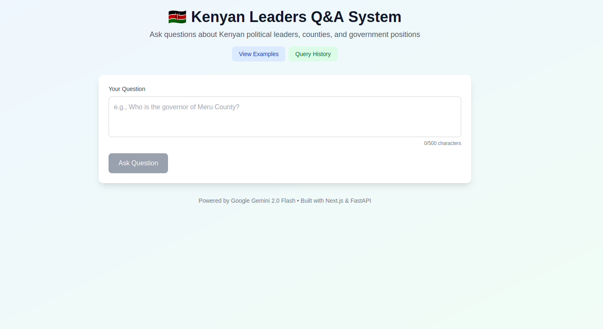
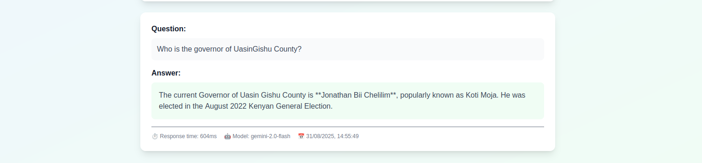
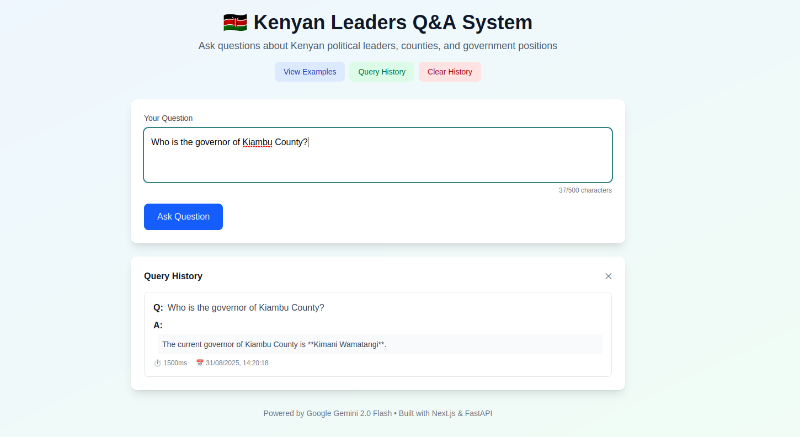
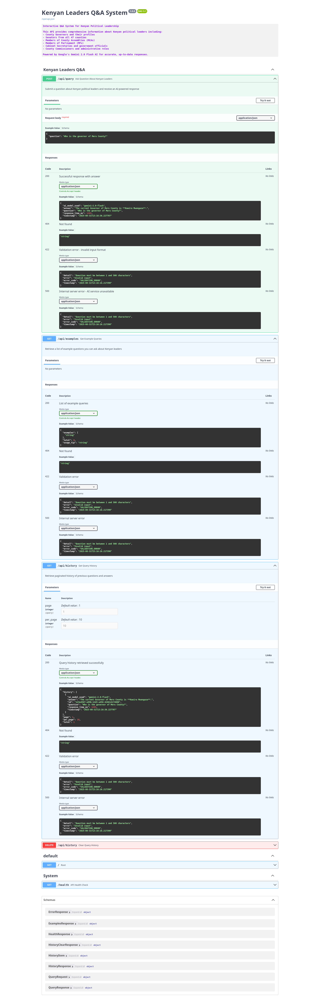

# 🇰🇪 Kenyan Leaders Q&A System

A modern, full-stack web application that serves as an interactive Q&A system for Kenyan political leadership information, powered by Google's Gemini 2.0 Flash AI.

## 🌐 Live Application

**🚀 Frontend Application:** [https://assignment-frontend-virid.vercel.app/](https://assignment-frontend-virid.vercel.app/)

**📚 Backend API Documentation:** [https://assignment-backend-production-c839.up.railway.app/docs](https://assignment-backend-production-c839.up.railway.app/docs)

## 🏗️ Architecture & Technology Stack

### Backend (FastAPI)
- **Framework:** FastAPI with Python 3.9+
- **AI Integration:** Google Gemini 2.0 Flash API
- **Documentation:** Automatic OpenAPI/Swagger documentation
- **Deployment:** Railway
- **Features:** Query history, comprehensive error handling

### Frontend (Next.js)
- **Framework:** Next.js 14+ with TypeScript
- **Styling:** TailwindCSS for responsive design
- **Deployment:** Vercel
- **Architecture:** Modular component structure
- **Features:** Real-time API integration, loading states, error boundaries

## 📸 Application Screenshots

### Frontend Interface - Main Page

*Clean, professional interface with Kenyan flag branding and intuitive navigation*

### Interactive Q&A Experience

*Real-time AI responses with professional formatting*

### Query History Feature (Bonus)

*Persistent query history with pagination and clear functionality*

### Professional API Documentation

*Comprehensive FastAPI documentation with interactive testing capabilities*

## ✨ Key Features

### Core Requirements ✅
- **Interactive Q&A System** - Ask questions about Kenyan political leaders
- **Modern Responsive UI** - Works seamlessly on desktop and mobile
- **Real-time AI Integration** - Google Gemini 2.0 Flash for accurate responses
- **Loading States** - Professional user feedback during API calls
- **Error Handling** - Comprehensive error management and user feedback
- **Input Validation** - Both client-side and server-side validation

### Bonus Features 🎯
- **Query History System** - View and manage previous questions/answers
- **Example Queries** - Curated examples to guide users
- **Professional API Documentation** - Interactive Swagger/OpenAPI docs
- **Modular Architecture** - Clean component separation for maintainability
- **Performance Optimization** - Efficient API calls and state management

## 🚀 Quick Start

### Prerequisites
- Node.js 18+ and npm
- Python 3.9+ and pip
- Google Gemini API key

### Frontend Setup
```bash
cd frontend
npm install
npm run dev
```
Access at: http://localhost:3000

### Backend Setup
```bash
cd backend
pip install -r requirements.txt
export GOOGLE_API_KEY="your-api-key"
uvicorn app.main:app --reload
```
API docs at: http://localhost:8000/docs

## 🔧 Environment Configuration

### Frontend (.env.local)
```bash
NEXT_PUBLIC_API_URL=https://assignment-backend-production-c839.up.railway.app
```

### Backend (.env)
```bash
GOOGLE_API_KEY=your_google_gemini_api_key
```

## 📡 API Endpoints

| Method | Endpoint | Description |
|--------|----------|-------------|
| GET | `/docs` | Interactive API documentation |
| POST | `/api/query` | Submit questions about Kenyan leaders |
| GET | `/api/examples` | Get example queries |
| GET | `/api/history` | Retrieve query history (paginated) |
| DELETE | `/api/history` | Clear query history |
| GET | `/health` | API health check |

## 💡 AI Prompts & Implementation

### Specialized Gemini Prompt
The system uses a carefully crafted prompt to ensure accurate, relevant responses about Kenyan political leadership:

```python
prompt = f"""
You are a knowledgeable assistant specializing in Kenyan political leadership 
and government structure. Please provide accurate, up-to-date information about 
Kenyan leaders including:
- County Governors and their profiles
- Senators from all 47 counties  
- Members of County Assemblies (MCAs)
- Members of Parliament (MPs)
- Cabinet Secretaries and government officials
- County Commissioners and administrative roles

Question: {question}

Please provide a concise, informative response. If you don't have current 
information, please indicate that and provide the most recent information available.
"""
```

## 🏛️ Project Structure

```
├── frontend/                 # Next.js Frontend Application
│   ├── src/
│   │   ├── app/             # Next.js 14 App Router
│   │   │   ├── page.tsx     # Main application page
│   │   │   └── layout.tsx   # Root layout
│   │   └── components/      # Reusable React components
│   │       ├── Header.tsx   # Navigation header
│   │       ├── QueryForm.tsx# Question input form
│   │       ├── ResponseDisplay.tsx # AI response display
│   │       ├── HistoryPanel.tsx    # Query history
│   │       ├── ExamplesPanel.tsx   # Example queries
│   │       └── ErrorDisplay.tsx    # Error handling
│   ├── package.json
│   └── tailwind.config.js
│
├── backend/                  # FastAPI Backend Application
│   ├── app/
│   │   ├── main.py          # FastAPI application setup
│   │   ├── models/
│   │   │   └── schemas.py   # Pydantic data models
│   │   ├── routers/
│   │   │   └── qa.py        # API route handlers
│   │   └── services/
│   │       ├── gemini_service.py  # AI integration
│   │       └── history_service.py # Query management
│   ├── requirements.txt
│   ├── Procfile            # Railway deployment
│   └── railway.json        # Railway configuration
```

## 🔒 Security & Best Practices

- **Environment Variables** - Sensitive data secured via environment variables
- **Input Validation** - Pydantic models ensure data integrity
- **CORS Configuration** - Properly configured for cross-origin requests
- **Error Handling** - Comprehensive error management without exposing internals
- **Rate Limiting** - Built-in FastAPI protections
- **Type Safety** - Full TypeScript implementation

## 📊 Performance & Optimization

- **Optimized API Calls** - Efficient data fetching and state management
- **Lazy Loading** - Components load efficiently
- **Mobile Responsive** - Optimized for all device sizes

## 🚢 Deployment

### Backend - Railway
- **Platform:** Railway (railway.app)
- **Auto-deployment:** Connected to Git repository
- **Environment:** Production-ready with health checks
- **URL:** https://assignment-backend-production-c839.up.railway.app

### Frontend - Vercel  
- **Platform:** Vercel (vercel.com)
- **Auto-deployment:** Connected to Git repository
- **Global CDN:** Fast worldwide access
- **URL:** https://assignment-frontend-virid.vercel.app

## 🧪 Testing & Quality Assurance

### Tested Features ✅
- All API endpoints functional and documented
- Frontend-backend integration working seamlessly
- Responsive design across devices (mobile, tablet, desktop)
- Error handling for network failures and invalid inputs
- Query history functionality (create, read, clear)
- Cross-browser compatibility

### Code Quality
- **TypeScript** - Full type safety in frontend
- **Pydantic** - Data validation and serialization in backend
- **Component Architecture** - Modular, reusable React components
- **Error Boundaries** - Graceful error handling
- **Clean Code** - Well-structured, documented codebase


This project demonstrates modern full-stack development practices suitable for production environments. The architecture supports easy extension and maintenance.

## 📄 License

MIT License - Built as a technical assessment demonstration.

---

**🚀 Live Application:** [https://assignment-frontend-virid.vercel.app/](https://assignment-frontend-virid.vercel.app/)

**📚 API Documentation:** [https://assignment-backend-production-c839.up.railway.app/docs](https://assignment-backend-production-c839.up.railway.app/docs)